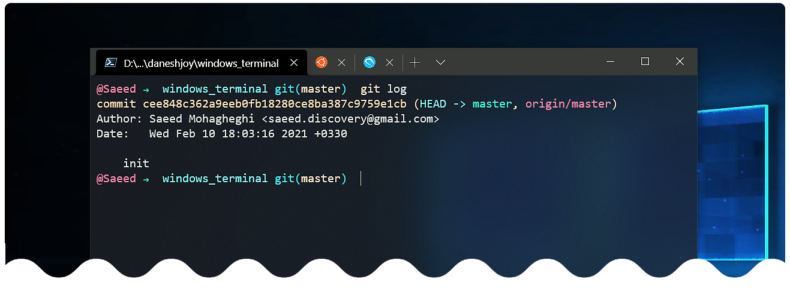
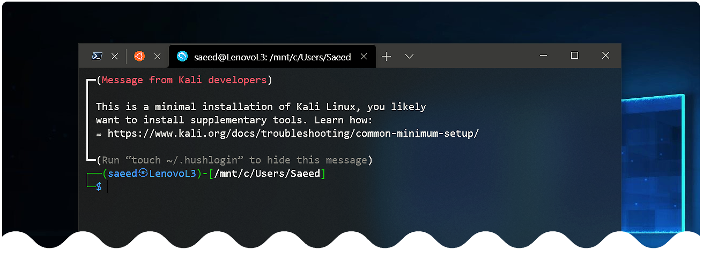

# Customize Windows Terminal



- Better to install the new PowerShell: https://docs.microsoft.com/en-us/powershell/
- You can do it via Microsoft Store: https://www.microsoft.com/store/apps/9MZ1SNWT0N5D

-------------------------

## Keyboard shortcuts
- Keyboard shortcuts are listed in "defaults.json" (in Terminal: Alt + Click on Setting)

-------------------------

## Themes
- Default themes are in "defaults.json"

### * Additional Themes
- There are good themes in https://windowsterminalthemes.dev/
- Add your theme's code to the "Schemes" part of the Terminal "settings.json" (normal settings of Terminal)
- Use the name of the desired theme at desired profile:
    ``` "colorScheme": "Horizon" ```

> **Using Acrylic**
    ```
    "useAcrylic": true,
    "acrylicOpacity": 0.7
    ```

-------------------------

## Customize command prompt



- Add Cascadia font to Terminal profiles in "settings.json":
"fontFace": "Cascadia Code PL"

- Install posh and oh-my-posh from Powershell (should be done in both "PowerShell" & "Windows PowerShell"):
    ```
    > Install-Module posh-git -Scope CurrentUser
    > Install-Module oh-my-posh -Scope CurrentUser
    ```

> For "Windows PowerShell", you should run as admin & change ExecutionPolicy for further steps:
    ``` > Set-ExecutionPolicy RemoteSigned ```

- Create PowerShell profile if not exists:
    - for "PowerShell":
    %HOMEPATH%\Documents\PowerShell\Microsoft.PowerShell_profile.ps1
    - for "Windows PowerShell":
    %HOMEPATH%\Documents\WindowsPowerShell\Microsoft.PowerShell_profile.ps1

- Put these lines in profile and save it:
    ```
    Import-Module posh-git
    Import-Module oh-my-posh
    Set-Theme Zash
    ```

> Change Set-Theme parameter to your desired theme's name
    Theme names are listed in: https://github.com/JanDeDobbeleer/oh-my-posh#themes

-------------------------
## Tab icons

- Example:
    - Placing the icon image ubuntu.ico or ubuntu.png in the folder located at
    %LOCALAPPDATA%\Packages\Microsoft.WindowsTerminal_8wekyb3d8bbwe\RoamingState
    - you can display the icon by adding this line to the profile in your settings.json:
    
    ```
    "icon": "ms-appdata:///roaming/ubuntu.ico"
    or
    "icon": "ms-appdata:///roaming/ubuntu.png"
    ```