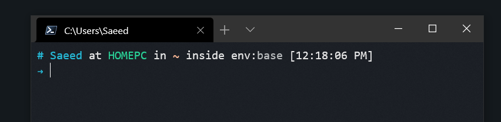

# Customize Windows Terminal

- Get started: [Install and set up Windows Terminal](https://docs.microsoft.com/en-us/windows/terminal/get-started)
- Install from the Microsoft Store: [Terminal in Microsoft Store](https://aka.ms/terminal)


- Better to install the new PowerShell: https://docs.microsoft.com/en-us/powershell/
- You can do it via Microsoft Store: https://www.microsoft.com/store/apps/9MZ1SNWT0N5D

-------------------------

## Keyboard shortcuts
- Keyboard shortcuts are listed in "defaults.json" (in Terminal:  hold <kbd>Alt</kbd> and click on Settings)
- They are also listed in the command pallete: <kbd>Ctrl</kbd>+<kbd>Shift</kbd>+<kbd>P</kbd>

-------------------------

## Themes
- Default themes are in "defaults.json"

### * Additional Themes
- There are good themes in https://windowsterminalthemes.dev/
- Add your theme's code to the "Schemes" part of the Terminal "settings.json" (i.e. normal settings of the Terminal). Example:
    ```
    // Add custom color schemes to this array.
    // To learn more about color schemes, visit https://aka.ms/terminal-color-schemes
    "schemes": [
        {
            "name": "Horizon",
            "black": "#0a0a0d",
            "red": "#E95678",
            "green": "#29D398",
            "yellow": "#FAB795",
            "blue": "#26BBD9",
            "purple": "#EE64AC",
            "cyan": "#59E1E3",
            "white": "#e5e5e5",
            "brightBlack": "#848484",
            "brightRed": "#EC6A88",
            "brightGreen": "#3FDAA4",
            "brightYellow": "#FBC3A7",
            "brightBlue": "#3FC4DE",
            "brightPurple": "#F075B5",
            "brightCyan": "#6BE4E6",
            "brightWhite": "#e5e5e5",
            "background": "#1c1e26",
            "foreground": "#bdc0c2"
        }
    ],
    ```
- Use the name of the desired theme at desired profile. Example: ``` "colorScheme" : "Horizon" ```
    ```
    {
        "guid": "{574e775e-4f2a-5b96-ac1e-a2962a402336}",
        "name": "PowerShell",
        "source": "Windows.Terminal.PowershellCore",
        "commandline": "pwsh.exe /nologo",
        "colorScheme" : "Horizon",
        "startingDirectory": "."
    },
    ```

> **Using Acrylic**
    You can add these parameters to the desired profile to have an acrylic (i.e. semi-transparent) look:
    ```
    "useAcrylic": true,
    "acrylicOpacity": 0.7
    ```

-------------------------

## Customize command prompt


1. Oh My Posh was designed to use Nerd Fonts. Nerd Fonts are popular fonts that are patched to include icons. We recommend [Meslo LGM NF](https://github.com/ryanoasis/nerd-fonts/releases/download/v2.1.0/Meslo.zip) , but any Nerd Font should be compatible with the standard themes.
    - Terminal-Icons is a PowerShell module that adds file and folder icons when displaying items in the terminal. This relies on the custom fonts provided by Nerd Fonts.
    ```
    > Install-Module -Name Terminal-Icons -Repository PSGallery
    ```

2. Install posh and oh-my-posh from Powershell (should be done in both "PowerShell" & "Windows PowerShell"):
    ```
    > Install-Module posh-git -Scope CurrentUser
    > Install-Module oh-my-posh -Scope CurrentUser
    ```
    In case you're running this on PS Core, make sure to also install version 2.0.0-beta1 of PSReadLine
    ```
    Install-Module -Name PSReadLine -AllowPrerelease -Scope CurrentUser -Force -SkipPublisherCheck
    ```

    > For "Windows PowerShell", you should run as admin & change ExecutionPolicy for further steps:
        ``` > Set-ExecutionPolicy RemoteSigned ```

3. Create PowerShell profile if not exists (in both "PowerShell" and "Windows PowerShell"):
    ```
    if (!(Test-Path -Path $PROFILE )) { New-Item -Type File -Path $PROFILE -Force }
    ```
4. Open the profile with an editor (e.g. notepad)
    ```
    notepad $PROFILE
    ```

5. Put these lines in profile and save it:
    ```
    Import-Module posh-git
    Import-Module oh-my-posh
    Import-Module -Name Terminal-Icons
    Set-PoshPrompt -Theme Paradox
    ```
    You can preview all prompt themes by:
        ```
        Get-PoshThemes
        ```
6. Restart the shell

> Change Set-Theme parameter to your desired theme's name
    - Some of theme names are listed in: https://github.com/JanDeDobbeleer/oh-my-posh#themes
    - You can get all theme names by this command: ```Set-Theme x```

-----

    Here is an example with the following settings:
        ```
        "fontFace" : "Cascadia Code PL",
        "colorScheme" : "Wryan"
        ``` and
        ```Set-Theme Paradox```
        
    

-------------------------
## Tab icons

- Example:
    - Place the icon image "ubuntu.ico" or "ubuntu.png" in the folder located at
    ``` %LOCALAPPDATA%\Packages\Microsoft.WindowsTerminal_8wekyb3d8bbwe\RoamingState ```
    - you can display the icon by adding this line to the ubuntu profile in the settings.json:

        ```
        "icon": "ms-appdata:///roaming/ubuntu.ico"
        or
        "icon": "ms-appdata:///roaming/ubuntu.png"
        ```

-------------------------
## Remove PowerShell welcome message

- Add the following line to the profile:
- For PowerShell: ``` "commandline": "pwsh.exe /nologo" ```
- For Windows PowerShell: ``` "commandline": "powershell.exe /nologo" ```

-------------------------
## Show Anaconda environments

- To show the conda env name in the prompt, change the "commandline" section to execute the conda script at PowerShel startup
- Example for miniconda:
    - PowerShell:
    ```
    "commandline": "pwsh.exe /nologo -NoExit -Command \"& 'C:\\Users\\%USERNAME%\\miniconda3\\shell\\condabin\\conda-hook.ps1' ; conda activate 'C:\\Users\\%USERNAME%\\miniconda3' \""
    ```
    - Windows PowerShell
    ```
    "commandline": "powershell.exe /nologo -NoExit -Command \"& 'C:\\Python\\miniconda3\\shell\\condabin\\conda-hook.ps1' ; conda activate 'C:\\Python\\miniconda3' \"",
    ```
    Here is an example with the following settings:
        ```
        "fontFace" : "Cascadia Code PL",
        "colorScheme" : "Horizon"
        ``` and
        ```Set-Theme Honukai```
    
    > Note that not all the oh-my-posh themes support this! change themes and see which ones show the env name.
